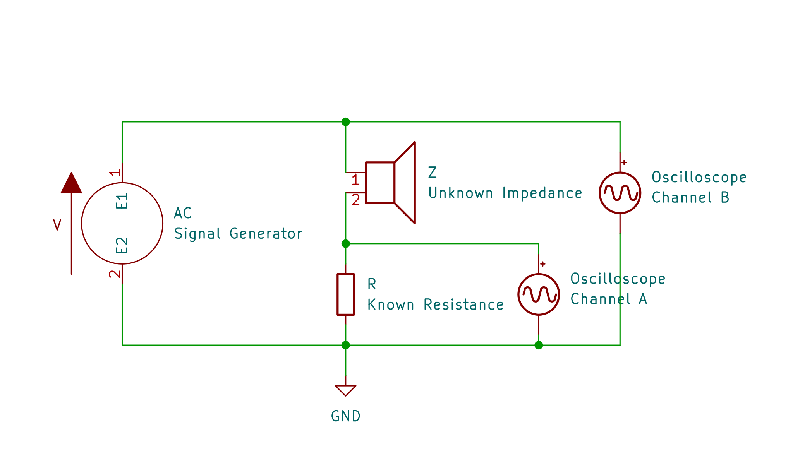
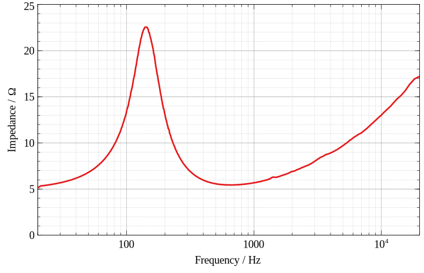

# Oscilloscope Impedance Calculator

Oscilloscope Impedance Calculator (OIC) is a small command-line tool I wrote to help me plot loudspeaker impedance over frequency. It reads data from CSV files, so it can potentially work with the output from any oscilloscope.

## Requirements

* .NET 6 https://dotnet.microsoft.com/en-us/download/dotnet/6.0
* Windows 10 64bit (it should work with other OSes if recompiled from source).
* An oscilloscope capable of exporting data as CSV
* A signal generator

## Installation

Just extract the zip somewhere.

## Measurement Setup

First you need to set up your oscilloscope and signal generator as in the following diagram:

R is a known resistance that should be chosen to have a similar value to what the unknown impedance is expected to be. For instance 10Ω is a reasonable value for measuring speakers.

Since the absolute voltage doesn't matter, a signal generator with a 50Ω output impedance can be connected directly, though a power amplifier can be used between the signal generator and load if desired.

The signal generator needs to be set to output a logarithmic frequency sweep. The range of frequencies should be slightly wider than what you actually want to measure, since the highest and lowest frequencies may be lost along the way. e.g. 10Hz-30kHz is good if you actually want 20Hz-20kHz for the audio range.

The sweep time needs to be long enough to have plenty of cycles of the lowest frequencies. 1-50s is sufficient for the audio range, with longer times giving better frequency resolution at lower frequencies, at the cost of generating more data to process.

The output voltage needs to be high enough to be well above the noise floor.

## Capturing Data

Next, the oscilloscope needs to be set up to capture the frequency sweep.

It needs to be set to trigger at the start of the sweep, and stop at the end. If there's any silence at the start or end of the capture, or the sweep isn't monotonic, then it won't work properly.

The sample rate must be high enough to have plenty of samples for one cycle of the highest frequency. e.g. 200kS/s is enough for 30kHz.

OIC doesn't cope well with noise, so if possible, bandwidth should be limited as close as possible to the highest frequency.

For measuring low impedances like speakers, 1x oscilloscope probes are better, for lower noise.

Once captured, export the data as CSV. The exported data must consist of three columns: Time, Channel A, Channel B.

## Processing Data

OIC needs some arguments passed to it to tell it about the data.

* __-s__ The sample rate in samples per second. Default `200000`.
* __-r__ The value of the known resistance in ohms. Default `10.0`.
* __-f1__ The start frequency in Hz. Default `10`.
* __-f2__ The end frequency in Hz. Default `30000`.
* __-h__ The number of lines in the CSV before the first line of data, i.e. the header. Default `3`.
* __-i__ The path to the input file.
* __-o__ The path to the output file. If this is just a file name without a path then it will be created in the same folder as the input file. Default `out.csv`.
* __-t__ The maximum number of threads to use for processing. Default half the logical CPU cores.

For example, if your data was created with all the defaults (10Hz-30kHz, 200kS/s, 10Ω resistor) and was saved to `C:/data.csv`, and OIC is installed to `C:/OIC/` then you can run it like this:

    C:/OIC/OIC.exe -i C:/data.csv

If you need to customize some options then it might look like this:

    C:/OIC/OIC.exe -i C:/data.csv -o "C:/some folder/impedance.csv" -s 1e6 -f1 100 f2 100e3

Note that paths with spaces in must be enclosed in double-quotes, and scientific notation can be used for sample rate and frequency.

## Visualizing Data

The processed data is a CSV file with two columns - frequency in Hz and impedance in ohms. This can be plotted with your favourite sofware such as Excel or [Veusz](https://veusz.github.io/).

If everything went according to plan, you will end up with something that looks like this:

You may find that there are some outliers - points with an impedance much higher or lower than they should have, or frequencies higher than were actually present. These are due to noise. Unless the signal was really noisy, there shouldn't be many, so they can be removed manually. If the results are completely wrong, it may be because the sample rate was too low. If there aren't enough data points, then the sweep time may have been too fast.
